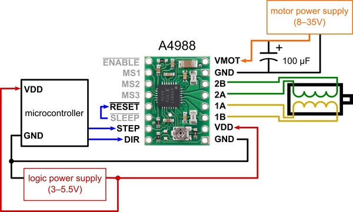

# ESP8266 Motorized Curtain


## Overview

This project automates curtain control using an ESP8266 microcontroller and a NEMA 17 stepper motor. It allows for remote curtain manipulation, making it ideal for home automation and convenience.

## Table of Contents

- [Features](#features)
- [Requirements](#requirements)
- [Hardware Setup](#hardware-setup)
- [Software Setup](#software-setup)
- [Usage](#usage)
- [Custom Smart Home Dashboard](#custom-smart-home-dashboard)
- [Contributing](#contributing)
- [License](#license)

## Features

- **Remote Control:** Open and close your curtains remotely using Wi-Fi connectivity.
- **Customizable:** Adjust the curtain's timing and positioning according to your preferences.
- **Integration:** Easily integrate the curtain control into your existing home automation systems.
- **Web Interface:** Control the curtain via a user-friendly web interface or a mobile app.

## Requirements

To replicate this project, you will need the following components:

- ESP8266 microcontroller (e.g., NodeMCU)
- NEMA 17 stepper motor
- Motor driver module (e.g., A4988)
- GT2 belt and 2 x GT2 Pulley
- Curtain rail and hooks
- 12V power supply
- Jumper wires
- Wi-Fi connection

## Hardware Setup

1. **Connect the Stepper Motor:**
   - Wire the NEMA 17 stepper motor to the motor driver module.
   - Connect the motor driver module to the ESP8266 microcontroller following the provided pinout information.
    


2. **Mount the Curtain Rail:**
- Securely attach the curtain rail to your curtain frame.

3. **Attach Curtains:**
- Hang your curtains on the rail using curtain hooks.

4. **Power Supply:**
- Connect a 12V power supply to both the motor driver module and the ESP8266.

## Software Setup

1. **Clone the Repository:**
   ```bash 
   git clone https://github.com/Manuka-Rathnayake/Automated-Curtain.git
2. **Go ahead and open the ino file**
- Do the necessory changes 
3. **Upload the Firmware:**
- Use the Arduino IDE or PlatformIO to upload the firmware provided in this repository to your ESP8266.
4. **Running**
- You have the flexibility to use your own smart home dashboard or utilize the one provided in the following repository: [Smart Home Dashboard Repo](https://github.com/Manuka-Rathnayake/Smart-home-dashboard.git). Simply follow the instructions in that repository to set up your dashboard for seamless integration with this project.

